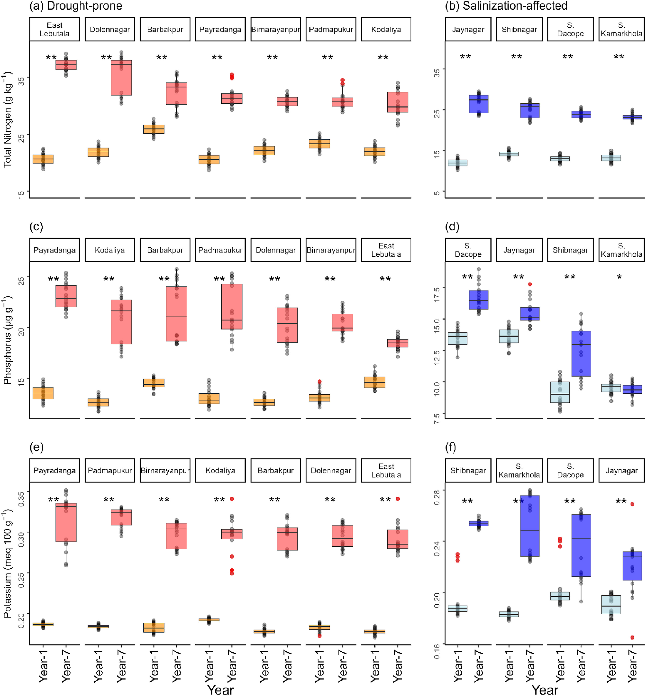
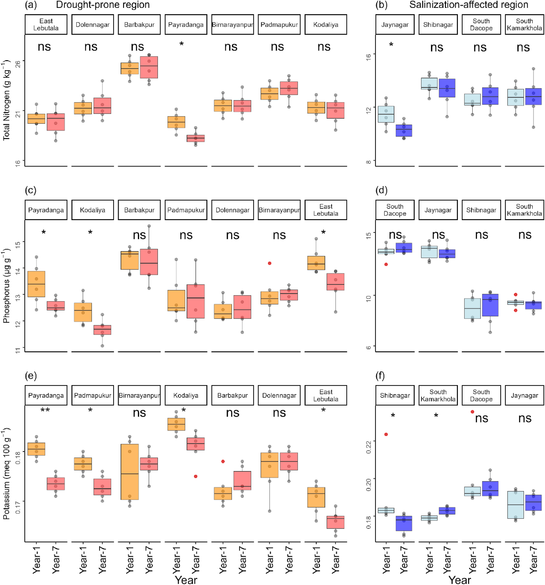

# Set Up

```{r}
#| label: read-in

# read in packages
library(tidyverse)
library(here)
library(janitor)
library(readxl)

# read in data
kelp <- read_csv(here("data", "temp-kelp.csv"))
walk <- read_csv(here("data", "ben-data-tracker.csv"))
```

# Problem 1

## a.

To determine the strength of the relationship between temperature (in Celsius) and kelp elongation rate (in cm per day), we will need a correlation test, of which there are two: Pearson's correlation (r) and Spearman's correlation ($\rho$). Both require independent observations. Pearson's correlation is the parametric version and also requires data that appears linear and continuous. Spearman's correlation is the nonparametric version and requires data that is monotonic, meaning that as one variable increases, the other variable, on average, strictly increases or decreases; the trend cannot go up and down. 

## b.

```{r}
#| label: kelp-visual

# create base layer using kelp data
# predictor (x-axis): temperature
# response (y-axis): kelp_elong
ggplot(data = kelp,
       aes(
         x = temp_c,
         y = kelp_elong
       )) +
  # add points, which creates a scatterplot for the data
  geom_point(
    # change color to a kelp-like color
    color = "seagreen4",
    # change default shape
    shape = 17
  ) +
  # change theme to remove gridlines
  theme_classic() +
  # rename x and y axes to make them more readable
  labs(
    x = "Temperature (celsius)",
    y = "Kelp Elongation (cm/day)"
  )
```

There may be a slight curve in the data, but a linear model also seems reasonable. We can check using diagnostic plots.

## c.

Since the data appears linear, we will run a Pearson's correlation, which requires checking for linearity (can be seen in the plot for 1b, it appears reasonably linear), the normality of the residuals and the homoscedasticity of the residuals.

### Diagnostic Plots

```{r}
#| label: kelp-model

# create a linear model in an object called kelp_model
# this lets us later test for linearity
kelp_model <- lm(
  # formula: kelp elongation as a function of temperature
  kelp_elong ~ temp_c,
  # use kelp data
  data = kelp
)
```

```{r}
#| label: diagnostic-kelp

# create diagnostic plots for the kelp model, displayed in a 2x2 grid
par(mfrow = c(2, 2))
plot(kelp_model)
```

The QQ plot of residuals has a few hiccups, but the data is close to the reference line with no obvious pattern, so the residuals are normally distributed.

The residuals are also homoscedastic since neither the residual vs fitted nor the scale-location model show clear patterns.

As a bonus, the residuals vs leverage plot also shows no outliers since all points are inside Cook's Distance.

Again, the plot from 1b also makes the assumption of linearity valid, as the data appears linear.

### Correlation Test

```{r}
#| label: correlation-test

# run pearson's correlation test
cor.test(kelp$temp_c, kelp$kelp_elong,
         method = "pearson")
```

To prepare for writing about the results, here are the important outputs.

t = -5.189

df = 30

p < 0.001

95% CI: [-0.836, -0.446]

r = -0.688

## d.

To evaluate the strength of the relationship between water temperature (in Celsius) and kelp elongation rate (in cm per day), we used Pearson's correlation. We chose this because the scatterplot of data showing this relationship appeared linear, and the residuals were normally distributed and showed homoscedasticity.

We found a moderate, inverse relationship between water temperature and kelp elongation rate (Pearson's r = -0.688, t(30) = -5.189, p < 0.001, $\alpha$ = 0.05).

## e.

We found a moderate, inverse relationship between water temperature and kelp elongation rate (Pearson's r = -0.688, t(30) = -5.189, p < 0.001, $\alpha$ = 0.05). Our model predicts that as water temperature increases, kelp will grow more slowly. As ocean temperatures warm due to climate change, kelp growth rate will likely decrease and threaten the health of kelp forest ecosystems.

## f.

The other test that could have been run was a Spearman's correlation, the non parametric variant of Pearson's correlation. The relationship appears monotonic, so the assumptions for this test were met too.

```{r}
#| label: kelp-spearman

# run spearman's correlation test
# without the exact = false, the test returns an error since some data is of 
# equal value and thus the same rank
cor.test(kelp$temp_c, kelp$kelp_elong,
         method = "spearman",
         exact = FALSE)
```

After accounting for ties, the test returns a similar p-value (< 0.001) and correlation ($\rho$ = -0.689). Therefore, we will interpret this test similarly. 

We found a moderate, inverse relationship between water temperature (in Celsius) and kelp elongation rate (in cm per day) (Spearman's $\rho$ = -0.689, S = 9216.1, p < 0.001, $\alpha$ = 0.05). Our model predicts that as water temperature increases, kelp will grow more slowly. As ocean temperatures warm due to climate change, kelp growth rate will likely decrease and threaten the health of kelp forest ecosystems.

# Problem 2

## a.

```{r}
#| label: plot-one

# create a new object to clean data
walk_clean <- walk |> 
  # remove uppercases and add underscores
  clean_names() |> 
  # remove N/A values
  drop_na()
# create a jitterplot for the data using walk_clean
ggplot(walk_clean,
       # x-axis: lunch location
       # y-axis: distance walked (in km)
       # color: set color by lunch location
       mapping = aes(x = lunch_location,
                     y = distance_walked_km,
                     color = lunch_location)) +
  # I want my y-axis to start at 0 so that scaling is visually accurate
  # Code from a geeksforgeeks forum
  scale_y_continuous(limits=c(0, 14)) +
  # Create a jitterplot
  geom_jitter(
    # stop vertical jitter
    height = 0,
    # narrow horizontal jitter
    width = 0.2) +
  # setting theme to black-white
  theme_bw() +
  # removing legend
  theme(legend.position = "None") +
  # renaming axes and title
  labs(
    # renaming x-axis
    x = "Lunch Location",
    # renaning y-axis
    y = "Distance Walked (km)",
    # including subtitle for including last observation
    subtitle = "Last Observation: 2026, May 24th"
  ) +
  # changing colors of various elements to improve contrast
  theme(
    # change x-axis color
    axis.text.x = element_text(color = "black"),
    # change y-axis color
    axis.text.y = element_text(color = "black"),
    # change panel background
    panel.background = element_rect(fill = "lemonchiffon"),
    # change panel lines to blend in with background
    panel.grid = element_line(color = "lemonchiffon")
    ) +
  # change colors of data points
  scale_colour_manual(values = c(
    # change campus to a gold color to match UCSB :)
    "Campus" = "goldenrod4",
    # change IV to a lovely green
    "IV" = "green4",
    # change Portola to red
    "Portola" = "tomato3",
    # change prepped to a blue color
    "Prepped" = "cornflowerblue"
  ))
```

```{r}
#| label: plot-two

# create a scatterplot for the data using walk_clean
ggplot(walk_clean,
       # x-axis: high temperature (in celsius)
       # y-axis: distance walked (in km)
       # color: set color by lunch location
       mapping = aes(x = high_temperature_c,
                     y = distance_walked_km)) +
  # once again starting y from 0
  # It would not make sense to set temperature to 0 too
  # (this would make it hard to visualize the data's spread), 
  # so I am leaving the x-axis as is
  scale_y_continuous(limits=c(0, 14)) +
  # create a scatterplot with pink points
  geom_point(color = "violetred4") +
  # setting theme to classic
  theme_classic() +
  # removing legend
  theme(legend.position = "None") +
  # renaming axes and title
  labs(
    # renaming x-axis
    x = "High Temperature (celsius)",
    # renaning y-axis
    y = "Distance Walked (km)",
    # creating subtitle with last observation
    subtitle = "Last Observation: 2026, May 24th"
  ) +
  # changing colors of various elements to improve contrast
  theme(
    # change x-axis color
    axis.text.x = element_text(color = "black"),
    # change y-axis color
    axis.text.y = element_text(color = "black"),
    # change panel background
    panel.background = element_rect(fill = "cornsilk3"),
    # change panel line colors to remove them
    panel.grid = element_line(color = "cornsilk3"))
```

## b.

### Plot 1

**Figure 1 - Distance Walked by Lunch Location**

Each point's vertical position in the jitterplot represents the distance I walked, in kilometers, in one day. The colors and horizontal position represent where I had lunch that day, with each color corresponding to one of four lunch locations. `Campus` means that I purchased lunch on the main UCSB campus. `IV` means I purchased lunch in Isla Vista or had lunch at my home in Isla Vista. `Portola` means I had lunch at Portola Dining Commons. `Prepped` means I made food at home and ate it elsewhere. Data collected from my own observations using the app `Map My Walk`.

### Plot 2

**Figure 2 - Distance Walked by High Temperature**

Each point's vertical position in the represents the distance I walked, in kilometers, in one day. The horizontal position represents the high temperature, in Celsius, for that day as predicted by the `Weather Underground` app when I woke up that morning. High temperature data is rounded to the nearest degree. Data collected from my own observations using the apps `Map My Walk` and `Weather Underground.`

# Problem 3

## a.

My personal data is about walking, but I don't want to take a fitness approach to it. Rather, I see walking as a way to slow down and view transit as a way to appreciate the world around you, so I want my visualization to reflect that in some way. Still, I can only appreciate the walk when I'm not stressed, which calendar events is a good proxy for. I also never used temperature in any of my infographic visualizations, and it's the only variable I didn't use, so I want to reflect that here in some way. Since I can represent many variables at once here (and Dear Data did that), I'll throw bus trips into the mix too.

I love the Dear Data visualizations, as it remains organized and readable while maintaining abstraction, it's a good way to get people curious about the data, and there is a lot of flexibility in how to show the data. I'm a plant person, and they're usually what I pay attention to during walks, so the plants (tomatoes specifically) are sneaking their way into this.

I will have number of fruits distance walked (rounded to the nearest kilometer). Roots ultimately support the plant, and when I'm stressed (more events), that should correspond to fewer roots. Temperature can be represented with leaf color (gradient, hot = leaves are burnt yellow). Bus trips can be represented by the number of flowers (the idea being that I often take the bus to go on a nice walk at the destination).

## b.

## c.

## d.

## e.

# Problem 4

## a.

The test being used is a Wilcoxon test. The response variable is the abundance of nitrogen, phosphorus and potassium in the soil while the predictor variable is the application of vermicompost compared to the control. This test is used to see if vermicompost does actually increase soil nutrients. A statistically significant result would indicate that vermicomposting increases soil nitrogen, phosphorus and potassium.





## b.

There is high visual clarity in the authors' figures. The boxplots establish metrics of central tendency and spread, and the underlying data is shown, though it doesn't distract from the boxplots. The axes are clear, and from the axes labels, it's easy to see that these are comparing soil characteristics at different locations over time. The colors are effective, making it easy to differentiate years and see outliers. My main critique is that the y-axis in the left column is not necessarily aligned with the y-axis in the right column (ex: chart c ranges from 15-25 while chart d to the right ranges from 7.5-17.5 despite no new label and being horizontally level with figure c).

## c.

The figure does a good job reducing visual clutter. The only elements are present are those that are essential to making the chart readable (for example, locations and axis labels). Listing year 1 and year 7 for every location does increase ink relative to data, and it could potentially be improved by using year as a major axis label and just listing the number for each location, but this could also make the chart less intuitive, so I understand the authors' choice. The overall data:ink ratio is fairly high; there is a lot of data described with little text.

## d.

The figures are mostly good as is, but I would realign figures b, d and f (right column) so that their y-axes aligned with figures a, c and e, as this would allow for better comparison between the drought-prone and salinization-affected regions. Listing year twice on the x-axis is also redundant, so I would remove the smaller year label and just keep the number.
